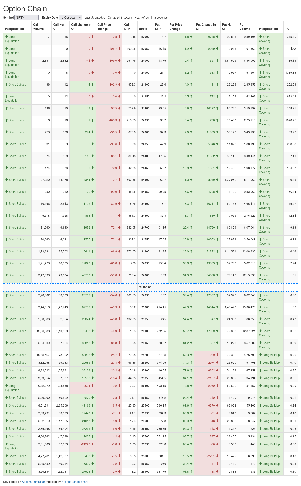

# Option Chain Analysis

## Original Developer: [Aaditya Tamrakar](https://github.com/aadityatamrakar)

## Modified by: [Krishna Singh Shahi](https://github.com/krishnasinghshahi)

---

[Original Developer Repo Readme](https://github.com/aadityatamrakar/option_chain_analysis/blob/master/README.md)

---

### Features

- **Auto Refresh**: The data automatically refreshes every 10 seconds to provide real-time updates.
- **Index Selection**: Users can select from various indices, including NIFTY, BANKNIFTY, FINNIFTY, and MIDCPNIFTY, for targeted analysis.

### Acknowledgements

This project builds upon the original work of Aaditya Tamrakar, whose contributions are greatly appreciated. I hope this analysis tool enhances your understanding of the market!

For more updates and contributions, feel free to check out my GitHub: [Krishna Singh Shahi](https://github.com/krishnasinghshahi)

## Page Screenshot

